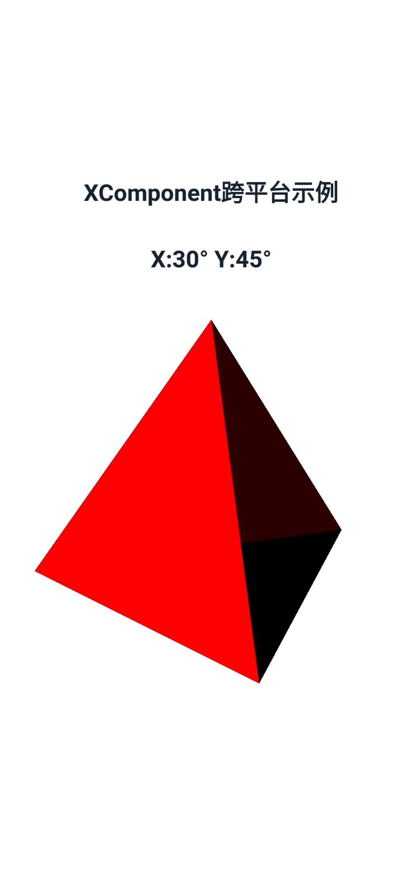
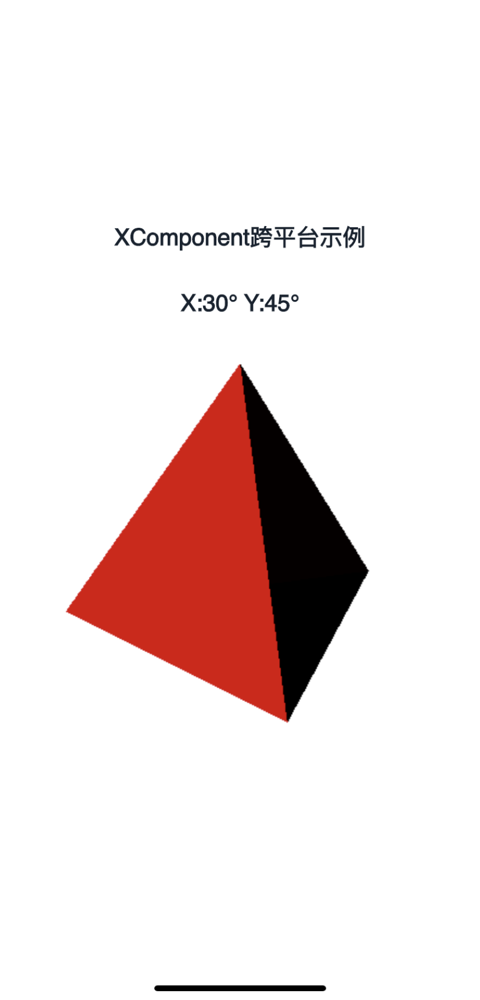
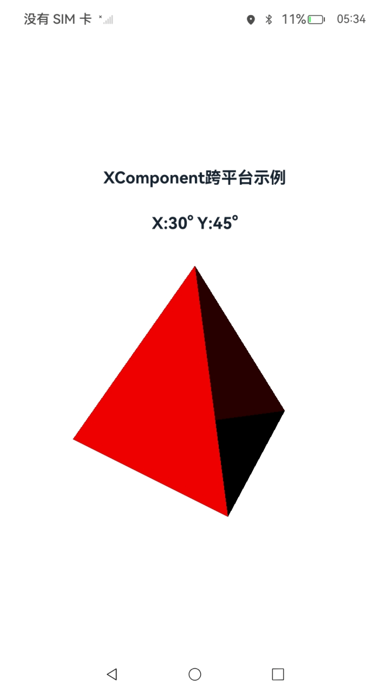
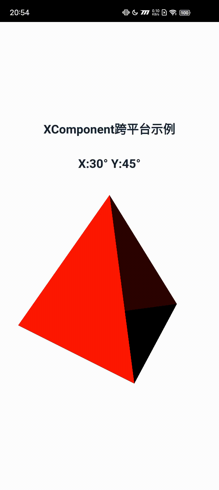
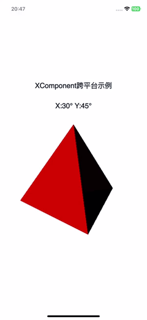
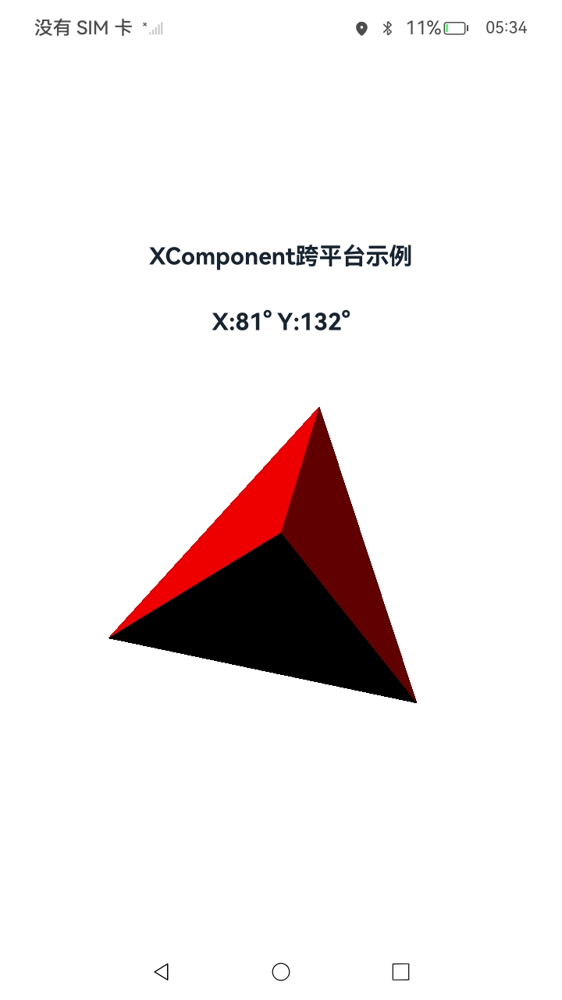

# XComponent应用示例

## 介绍

XComponent控件常用于视频流的显示和游戏画面的绘制，可以配合Native Window创建OpenGL开发环境，并最终将OpenGL绘制的图形显示到XComponent控件。调用OpenGL(OpenGL ES)图形库相关API绘制3D图形（三棱锥），并将结果渲染到页面的XComponent控件中进行展示。同时，还可以在屏幕上通过触摸滑动手势对三棱锥进行旋转，最终得到不同角度的图形并显示到页面。

## 效果预览

**应用初始**

| Android平台                                                  | iOS平台                                                      | 鸿蒙平台                                                     |
| ------------------------------------------------------------ | ------------------------------------------------------------ | ------------------------------------------------------------ |
|  |  |  |

**滑动屏幕旋转变换**

| Android平台                                                  | iOS平台                                                      | 鸿蒙平台                                                     |
| ------------------------------------------------------------ | ------------------------------------------------------------ | ------------------------------------------------------------ |
|  |  |  |

### 使用说明

应用界面中展示了XComponent相关控件的使用，采用OpenGL (OpenGL ES)相关标准API绘制3D图形（三棱锥，3D渲染光源采用简单线性光源）。

此外，可在屏幕触摸滑动，以使三棱锥进行旋转，其中主要采用了Native接口来更新3D图形的旋转角度。

1.打开app，首页显示标题文本、一个text和一个已绘制的三棱锥<br>
2.可在屏幕三棱锥区域触摸滑动、操作旋转三棱锥

## 工程目录

```
entry/src/main/
|---cpp
|   |---include/util						// C++ 头文件
|   |       |---hilog
|   |       	|---log_inner.h
|   |       |---log.h
|   |       |---napi_manager.h
|   |       |---napi_util.h
|   |       |---native_common.h
|   |---types
|       |---libentry
|           |---oh-package.json5
|           |---xcomponent_napi.d.ts         // 接口导出
|   |---app_napi.cpp                         // 调用native接口
|   |---app_napi.h
|   |---CMakeLists.txt                       // cmake编译配置
|   |---module.cpp                           // napi模块注册
|   |---napi_manager.cpp
|   |---napi_util.cpp
|   |---render_surface.h					 // OpenGL (ES) 三棱锥实现
|   |---render_surface.cpp					
|   |---render_surface.mm
|---ets
|   |---entryability
|   |   |---EntryAbility.ets
|   |---pages
|   |   |---Index.ets                        // 首页
|   |---utils
|       |---Logger.ets                       // 日志工具
```


## 具体实现

* 基本的页面展示封装在Index，源码参考:[Index.ets](entry/src/main/ets/pages/Index.ets)
  
  * 展示基本的UI界面：Text和XComponent组件的基本构造实现
  * XComponent组件负责展示三棱锥
  
* 基本的Native侧代码位于cpp目录，源码参考:[cpp](entry/src/main/cpp)
  
  * C++代码中定义接口Init和Update用于3D图形绘制环境的初始化和图形渲染更新，并映射NAPI相关接口UpdateAngle
  
  * ArkTS侧主要利用XComponent控件实现Index.ets，C++侧主要采用OpenGL ES相关标准API实现三棱锥的绘制流程相关代码，并可与ArkTS进行交互
  
  * 应用启动时，NAPI模块进行初始化，此时可通过C++侧的OH_NativeXComponent_GetXComponentId()接口，获取到当前XComponent控件的控件指针，并给到C++侧三棱锥绘制相关的Init和Update函数，实现3D图形显示
  
  * 触摸屏滑动旋转三棱锥时，在C++代码中映射的NAPI接口UpdateAngle给到ArkTS侧调用以实现更新三棱锥旋转角度
  
  * 使用的 Native XComponent相关函数如下：
  
    | 函数名称                                                     | 描述                                    |
    | ------------------------------------------------------------ | --------------------------------------- |
    | OH_NativeXComponent_GetXComponentId(OH_NativeXComponent *component, char *id, uint64_t *size) | 获取ArkUI XComponent的id                |
    | OH_NativeXComponent_GetXComponentSize(OH_NativeXComponent *component, const void *window, uint64_t *width, uint64_t *height) | 获取ArkUI XComponent持有的surface的大小 |
    | OH_NativeXComponent_GetTouchEvent(OH_NativeXComponent *component, const void *window, OH_NativeXComponent_TouchEvent *touchEvent) | 获取ArkUI XComponent调度的触摸事件      |
    | OH_NativeXComponent_GetTouchPointTiltX(OH_NativeXComponent *component, uint32_t pointIndex, float *tiltX) | 获取ArkUI XComponent触摸点倾斜与X轴角度 |
    | OH_NativeXComponent_GetTouchPointTiltY(OH_NativeXComponent *component, uint32_t pointIndex, float *tiltY) | 获取ArkUI XComponent触摸点倾斜与Y轴角度 |
    | OH_NativeXComponent_RegisterCallback(OH_NativeXComponent *component, OH_NativeXComponent_Callback *callback) | 实例注册回调                            |

## 相关权限

不涉及。

## 依赖

不涉及。

## 约束与限制

1.本示例仅支持标准Android/iOS/鸿蒙系统上运行。

2.本示例已适配API version 12版本的ArkUI-X SDK，版本号：2.0.0.31及以上，需要配套API version 12版本的OpenHarmony SDK，版本号：5.0.0.36及以上。

3.本示例需要使用DevEco Studio 5.0 Beta1 (Build Version: 5.0.3.403, built on June 21, 2024)及以上版本才可编译运行。

##### 针对CMakeLists.txt的检查说明：

- 代码路径：.arkui-x/android/app/src/main/cpp/CMakeLists.txt

1. 本示例需要配置“ARKUIX_SDK_HOME”的环境变量，用于CMakeLists.txt文件读取ArkUI-X SDK的文件位置。

2. CMakeLists.txt文件中的include路径需要检查对应API下的路径是否存在，例如下面路径，需要有API 13的ArkUI-X SDK存在：

```shell
set(NATIVE_INCLUDE_PATH "$ENV{ARKUIX_SDK_HOME}/13/arkui-x/engine/lib/include/")
```

## 下载

如需单独下载本工程，执行如下命令：

```
git init
git config core.sparsecheckout true
echo /XcomponentNative > .git/info/sparse-checkout
git remote add origin https://gitcode.com/arkui-x/samples.git
git pull origin master
```

