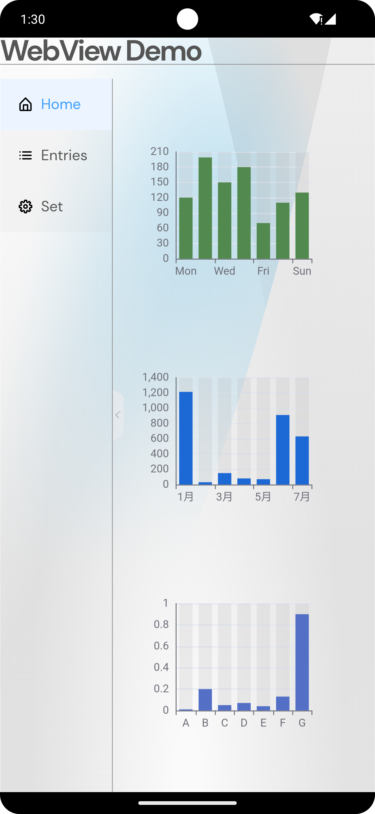
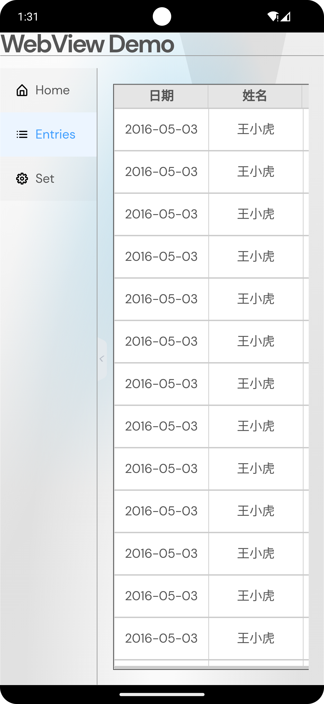
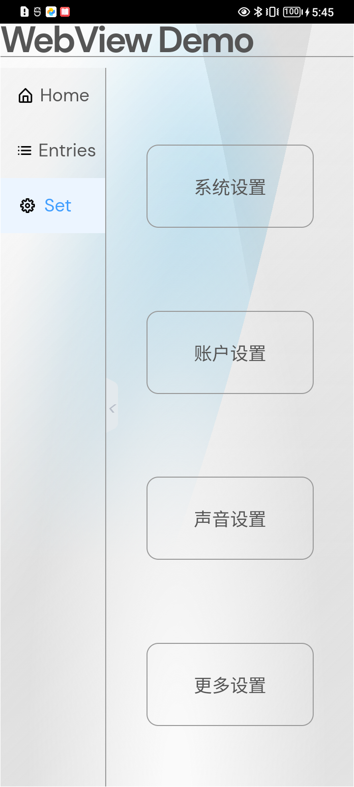
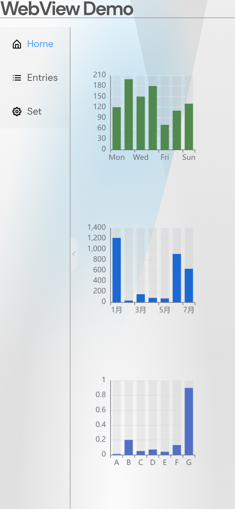
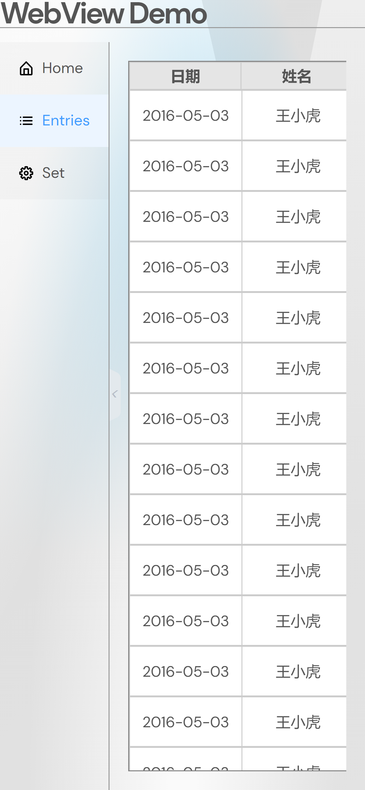
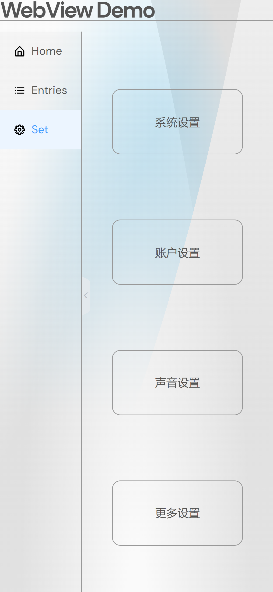
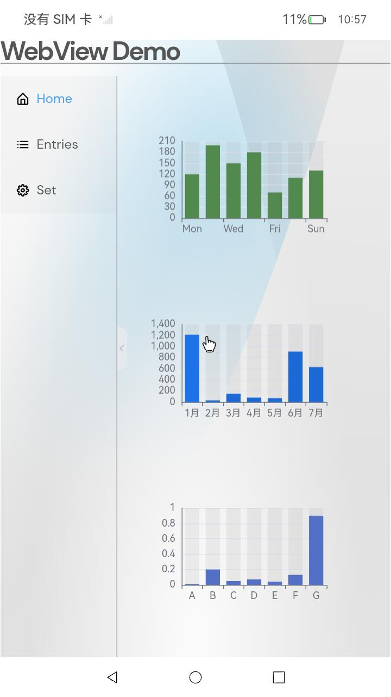
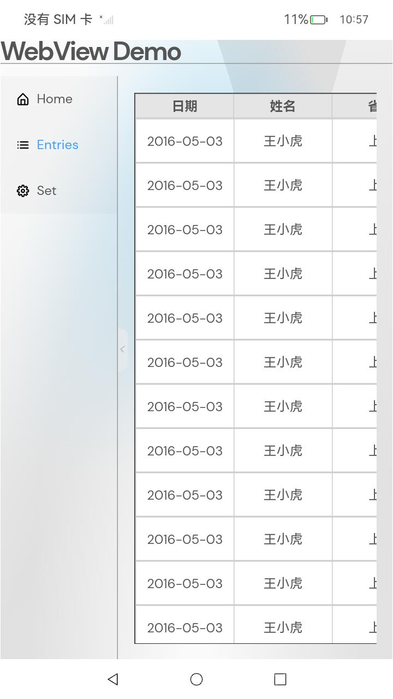
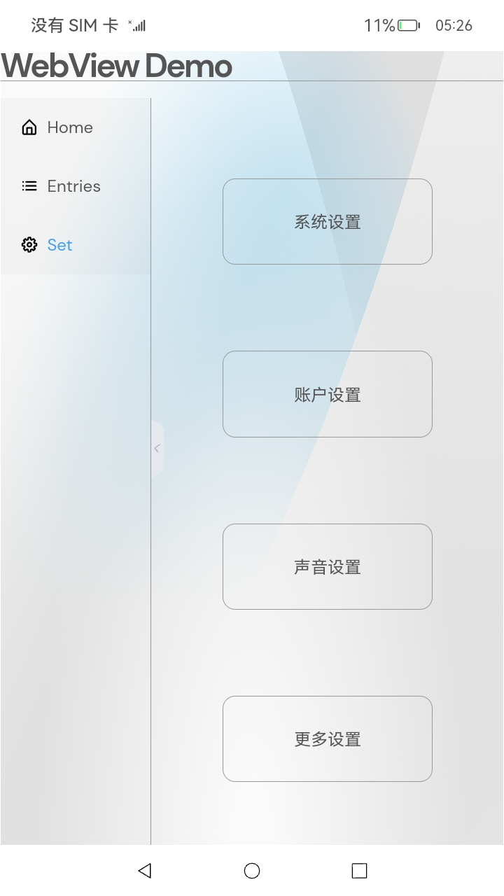

# Web组件Sample应用示例
## 简介
本示例通过[ArkUI-X] Entry Ability模版创建的一个工程,提供具有网页显示能力的Web组件，@ohos.web.webview提供web控制能力，实现了一个Web Sample应用。效果图如下：

* Android平台展示效果
    

* iOS平台展示效果
    

* OpenHarmony平台展示效果
    

## 相关概念

不涉及

## 相关权限

不涉及

## 使用说明

1、打开应用，首页左侧展示一个菜单栏，菜单栏支持收缩；右侧默认会展示Home标签页，即展示Home页的三个柱状图。

2、点击左侧Entries页签，右侧展示出一个文本列表，文本列表可以进行上下、左右滑动。

3、点击左侧Set页签，右侧展示了一个静态页面，里面有系统设置、账户设置、声音设置、更多设置。

## 约束与限制

1、本示例支持在Android\iOS\OpenHarmony平台上运行。

2、本示例需要使用DevEco Studio 4.0 Beta2及以上版本才可编译运行。