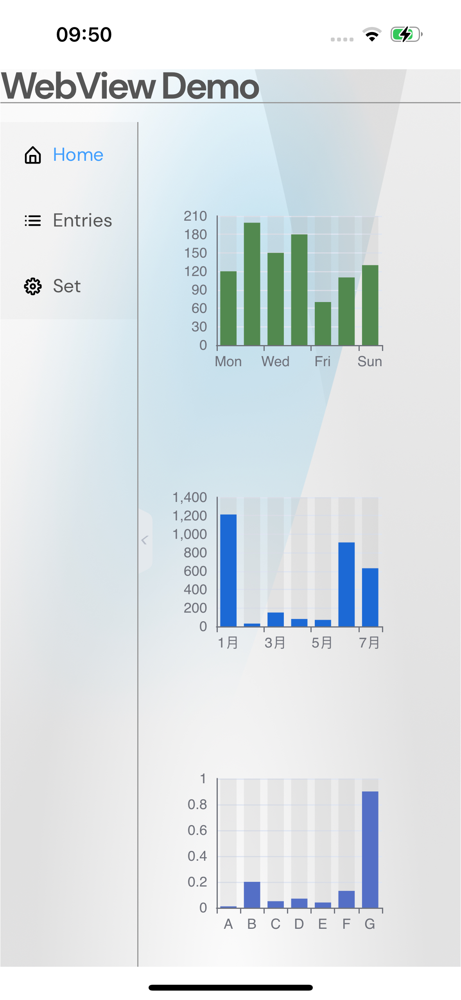

# Web组件Sample应用示例
## 简介
本示例通过[ArkUI-X] Entry Ability模版创建的一个工程,提供具有网页显示能力的Web组件，@ohos.web.webview提供web控制能力，实现了一个Web Sample应用。效果图如下：

* Android平台展示效果
    

* iOS平台展示效果
   

* OpenHarmony平台展示效果
    

## 相关概念

不涉及

## 相关权限

不涉及。

## 使用说明

1.打开应用，首页左侧展示一个菜单栏，右侧展示三个柱状图，菜单栏支持收缩。

2.点击左侧entries页签，右侧展示出一个文本列表。

3.点击左侧set页面，右侧为按钮+DIV的联动操作区，点击按钮可以对div进行操作。

## 约束与限制

1.本示例支持在Android\iOS\OpenHarmony平台上运行。

2.本示例需要使用DevEco Studio 4.0 Beta2及以上版本才可编译运行。