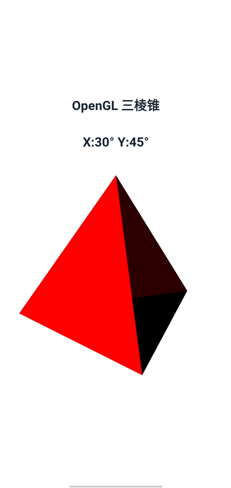
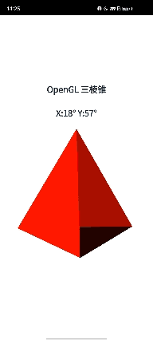
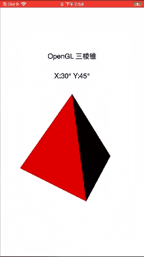

#  OpenGL三棱椎

## 介绍

XComponent控件常用于视频流的显示和游戏画面的绘制，可以配合Native Window创建OpenGL开发环境，并最终将OpenGL绘制的图形显示到XComponent控件。本示例通过[ArkUI-X] Native C++模版创建工程，调用OpenGL(OpenGL ES)图形库相关API绘制3D图形（三棱锥），并将结果渲染到页面的XComponent控件中进行展示。同时，还可以在屏幕上通过触摸滑动手势对三棱锥进行旋转，最终得到不同角度的图形并显示到页面。

## 简介
本示例通过[ArkUI-X] Native C++模版创建的一个跨平台工程

### 效果预览

- Android平台展示效果

  |                             首页                             |                    滑动屏幕旋转变换                     |
  | :----------------------------------------------------------: | :-----------------------------------------------------: |
  |  |  |

- IOS平台展示效果

  |                             首页                             |             滑动屏幕旋转变换              |
  | :----------------------------------------------------------: | :---------------------------------------: |
  |  |  |

### 工程目录

```
entry/src/main/
|---cpp
|   |---include/util
|   |       |---hilog
|   |       	|---log_inner.h
|   |       |---log.h
|   |       |---napi_manager.h
|   |       |---napi_util.h
|   |       |---native_common.h
|   |---types
|       |---libentry
|           |---oh-package.json5
|           |---xcomponent_napi.d.ts         // 接口导出
|   |---app_napi.cpp                         // 调用native接口
|   |---app_napi.h
|   |---CMakeLists.txt                       // cmake编译配置
|   |---module.cpp                           // napi模块注册
|   |---napi_manager.cpp
|   |---napi_util.cpp
|   |---render_surface.h					 // OpenGL (ES) 三棱锥实现
|   |---render_surface.cpp					
|   |---render_surface.mm
|---ets
|   |---entryability
|   |   |---EntryAbility.ets
|   |---pages
|   |   |---Index.ets                        // 首页
|   |---utils
|       |---Logger.ets                       // 日志工具
```

## 相关概念

不涉及。

## 相关权限

不涉及。

## 使用说明

应用界面中展示了XComponent相关控件的使用，采用OpenGL (OpenGL ES)相关标准API绘制3D图形（三棱锥，3D渲染的光源用的是简单的线性光源）。此外，可在屏幕触摸滑动，以使三棱锥进行旋转，其中主要采用了Native接口来更新3D图形的旋转角度。

1.打开app，首页面显示标题文本、一个text和一个已绘制的三棱锥
2.可在屏幕三棱锥区域触摸滑动，以使三棱锥进行旋转

## 约束与限制

1.本示例支持在Android\iOS平台上运行。

2.本示例需要使用DevEco Studio 4.0 Release及以上版本才可编译运行，OpenHarmony SDK 为11版本及以上。

