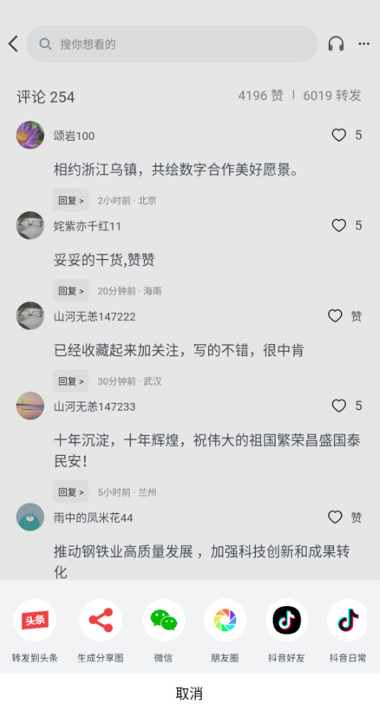
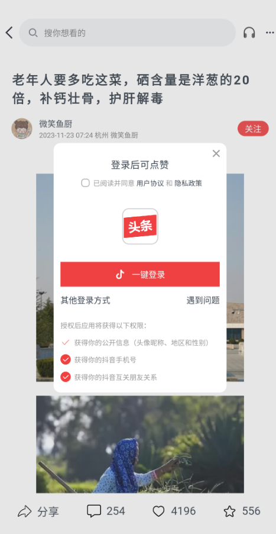
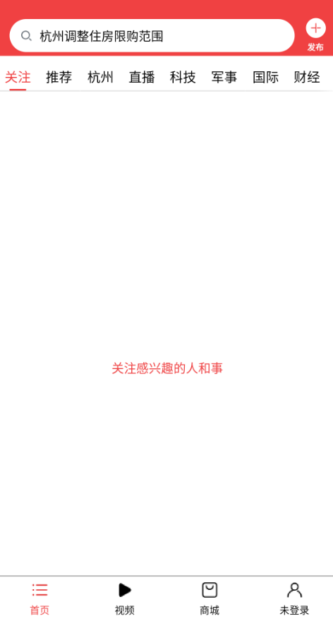
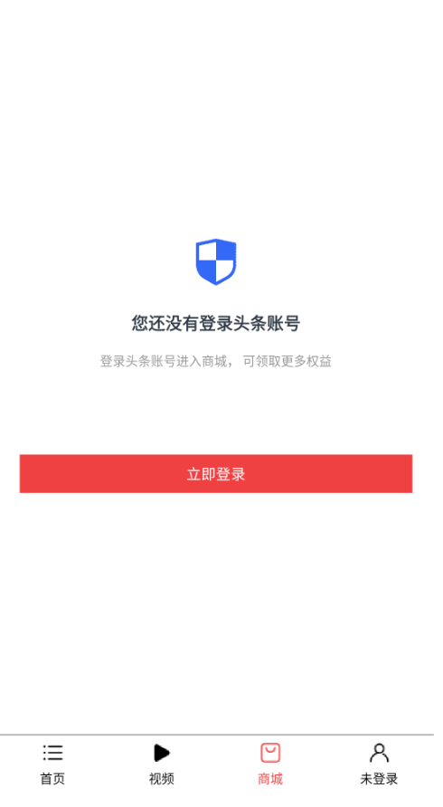
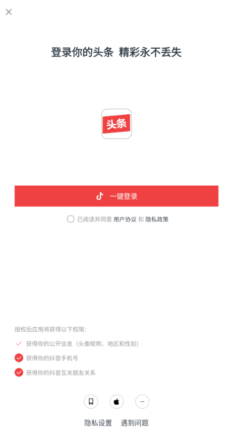

#### 简介
本示例通过 ace 创建的跨平台项目，可在ios、android、oh中运行

#### 注意事项
- 本项目使用http网络请求，请确保设备已连接网络

#### 使用说明
1. 连接网络获取头条接口链接
2. 首页推荐为新闻列表页，可下滑加载更多
- 
- 点击新闻进入详情页
- 
- 
- 点击分享
- 
- 点击点赞
- 
- 点击分享
- 
- 点击右上方更多图标
- 
3. 首页关注
- 
4. 视频页
- 
- 
5. 商城页
- 
6. 点击未登录
- 
#### 相关概念
不涉及
#### 相关权限
ohos.permission.INTERNET
#### 约束与限制
1.本示例支持在Android\iOS\OpenHarmony平台上运行。
2.本示例需要使用DevEco Studio 4.0 Beta2及以上版本才可编译运行。